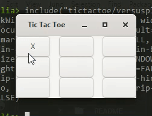
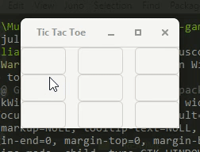

# Tic Tac Toe
Tic Tac Toe is a classic game also known as 'X and O'. Learn more about it at [Wikipedia](https://en.wikipedia.org/wiki/Tic-tac-toe).

You can play against a player or a computer using the `minimax` algorithm.

## Task Description
Write a Tic-Tac-Toe game using Julia.

The board of the game can be created using a basic 2-D Array or with GTK.jl.

The game should have a 2 person mode and also a single-player mode where you play against a basic AI.

Play using the console, with a single-player against the computer. Start with a simple, rule-based computer-player. Add some AI capabilities to improve the quality of the computer-player.

The final submission should include a GitHub Gist or GitHub Repo with the code and examples of the game being played in both modes.

## Install dependencies

```
using Pkg
Pkg.add("Gtk")
```

To play the game go to the console and enter `julia`, make sure that the Julia folder is in your system environment variables.

To play against a friend, type
```
julia> include("tictactoe/versusplayer.jl")
```

To play against the computer, type
```
julia> include("tictactoe/versuscomp.jl")
```

## Preview

### Player vs Player

----------------------

### Player vs Computer

----------------------

## References
A big thanks to [https://youtu.be/trKjYdBASyQ](https://youtu.be/trKjYdBASyQ)
