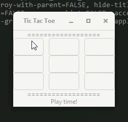

## Tic Tac Toe

### Preview

#### Player vs Player

----------------------

#### Player vs Computer

----------------------

### Install dependencies

```
using Pkg
Pkg.add("Gtk")
```

To play the game go to the console and enter `julia`, make sure that the Julia folder is in your system environment variables.

To play against a friend, type
```
julia> include("tictactoe/versusplayer.jl")
```

To play against the computer, type
```
julia> include("tictactoe/versuscomp.jl")
```
